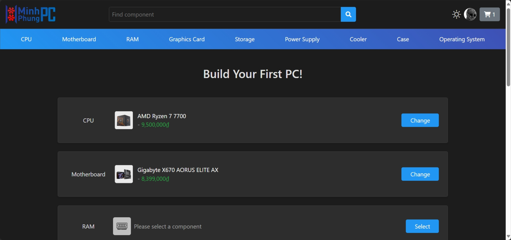

# **MinhPhungPC**

_A modern web application for university web development projects and competitions._  
**PC Shop & Builder Website** powered by **PostgreSQL** with a unified **JSONB** product system.

---

## 🚀 **Key Features**

- **Unified Core:** Single products table with flexible JSONB specifications.
- **PC Builder:** Dynamic hardware selection with real-time pricing.
- **Admin Panel:** Integrated dashboard for managing products and orders.
- **Modern UI:** Responsive, streamlined design for all devices.

---

## ⚡ **Quick Start**

1. **Environment:** Copy `.env.example` to `.env` and provide your PostgreSQL/SMTP credentials.
2. **Database:** Run `schema.sql` on your PostgreSQL instance.
3. **Run:** Serve with PHP 8.1+ (`app/index.php` as root).

---

    

---