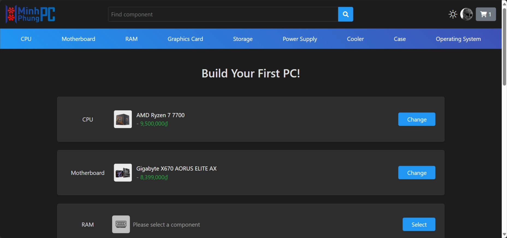

<div align="center">

  

  ## Introduction

  A website to sell and build desktop PCs using available components or purchase individual parts, featuring excellent functionalities and a robust compatibility checker.

  ## Installation

  Use it by placing it in the XAMPP `htdocs` folder, then open:

  ```
  localhost/MinhPhungPC
  ```

  

</div>